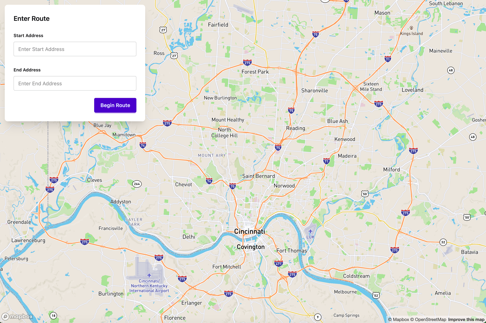
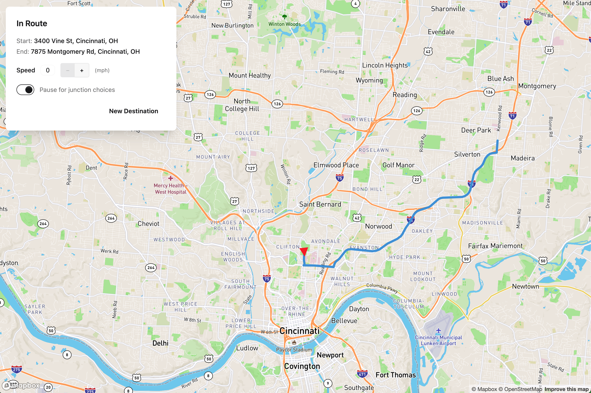
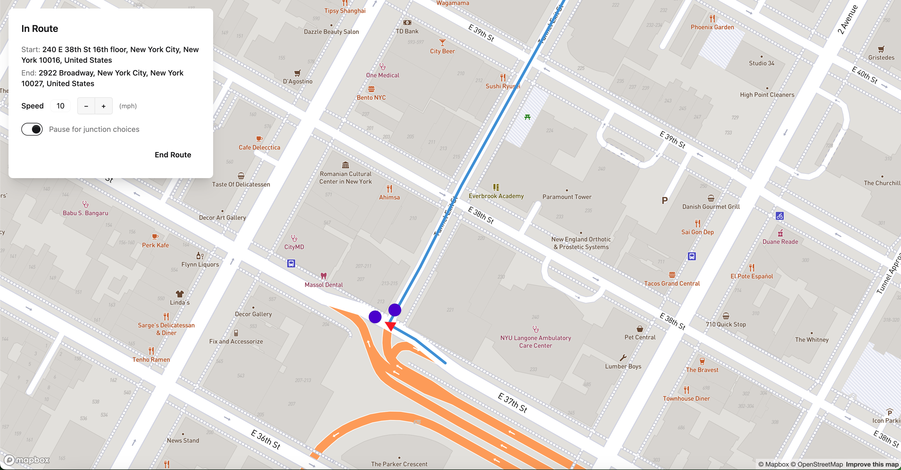

# Route Mapping & Driving Simulator
Calculates a driving route using a start and an end address, simulates and displays progress along route, and lets user control speed and choose next direction at intersections.

## Live Demo
**Live Demo Link:** [https://route-planning-lz7t.onrender.com](https://route-planning-lz7t.onrender.com)

### Instructions
- Click link above
- Enter start and end address
- Click begin route
- Adjust speed with + and - buttons
- Toggle pause for junction choices to manually choose direction at intersections
  
### Entering Route


### In Route


### Choosing Direction at Junction



## Run Locally
1. Clone the repository:
   ```bash
   git clone https://github.com/tgreenwald5/route-planning.git
   cd route-planning
   ```
2. Install dependencies:
   ```bash
   pip install -r requirements.txt
   ```
3. Set environment variable:
   - Obtain a free [Mapbox Access Token](https://docs.mapbox.com/help/dive-deeper/access-tokens/)
   - Create .env file in the project root
     ```bash
     MAPBOX_TOKEN=your_mapbox_access_token
     GRAPH_PATH=graphs/Manhattan_New_York_USA_drive.pkl
     ```
4. Start app:
   ```bash
   python server.py
   ```
   Open http://127.0.0.1:5000 in browser
   

## Working With Graph Data
- The already included road network graph (graphs/Manhattan_New_York_USA_drive.pkl) contains road network data just for Manhattan, New York, USA.
- However, road network graphs for other regions can be downloaded and used as well with the instructions below.

### Downloading
Use the provided download_graph.py script to download and save a road network graph:
```bash
python download_graph.py "[REGION_NAME]"
```
Example:
```bash
python download_graph.py "Atlanta, Georgia, USA"
```
This will create a pickle file in the graphs/ folder with the new road network graph:
```bash
graphs/Atlanta_Georgia_USA_drive.pkl
```

### Changing Road Network Graph
Edit your .env file and set the graph path:
```bash
GRAPH_PATH=graphs/[GRAPH_FILENAME].pkl
```


## Tech Used

### Frontend
- HTML, CSS, JavaScript
- [Tailwind CSS](https://tailwindcss.com/) + [DaisyUI](https://daisyui.com/)
- [Mapbox GL JS](https://docs.mapbox.com/mapbox-gl-js/guides)

### Backend
- Python
- [Flask](https://flask.palletsprojects.com/en/stable/)
- [OSMnx](https://osmnx.readthedocs.io/en/stable/)
- [Geopy](https://geopy.readthedocs.io/en/stable/)


## Citations
  > Boeing, G. (2025). Modeling and Analyzing Urban Networks and Amenities with OSMnx. 
  > Geographical Analysis, published online ahead of print. doi:10.1111/gean.70009
